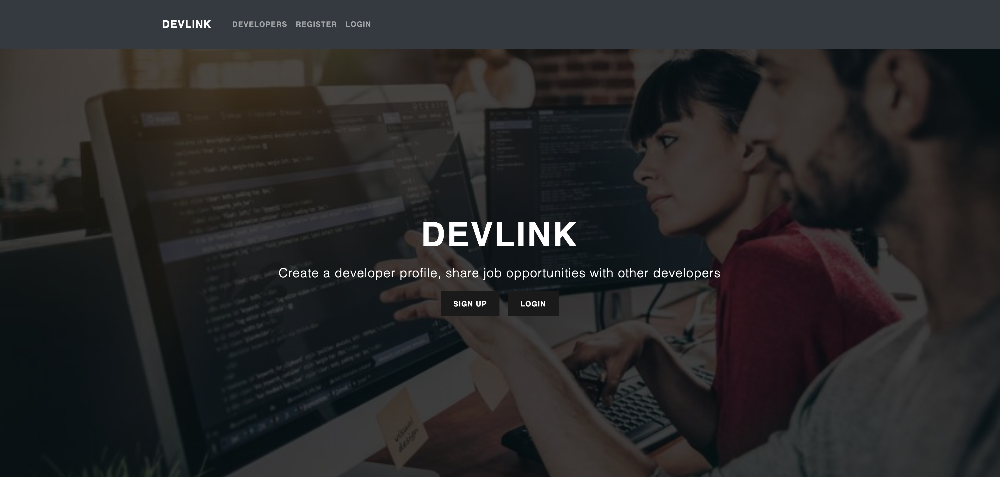
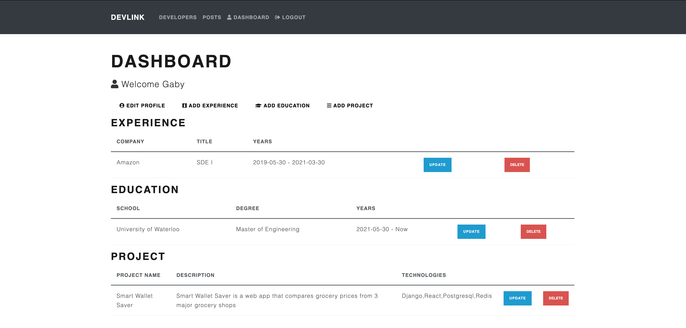
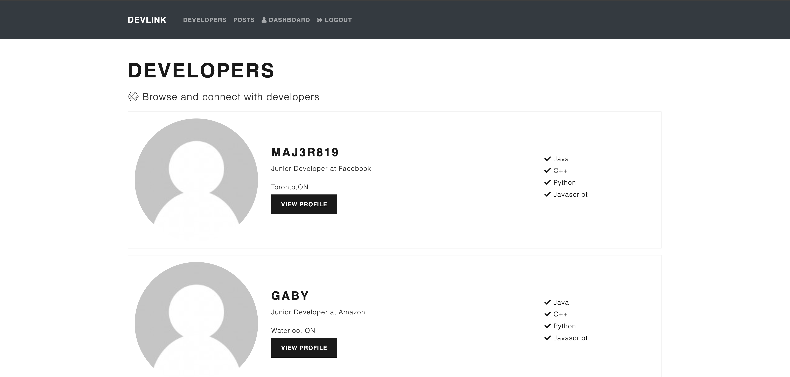
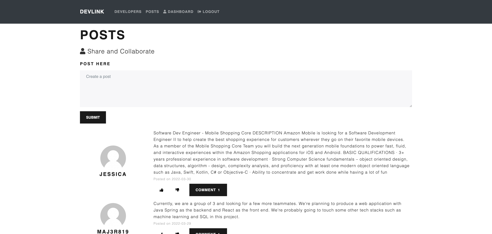
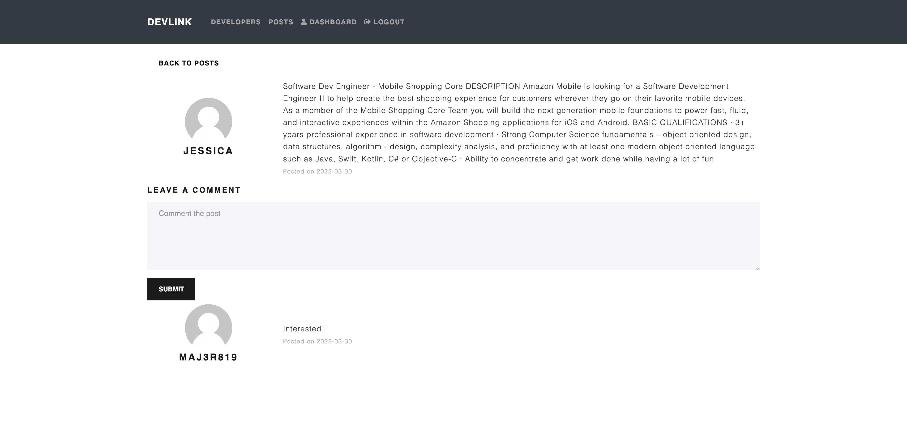
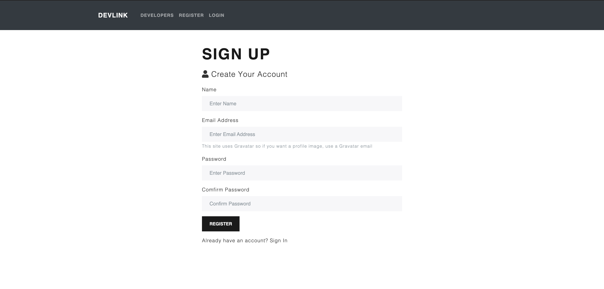
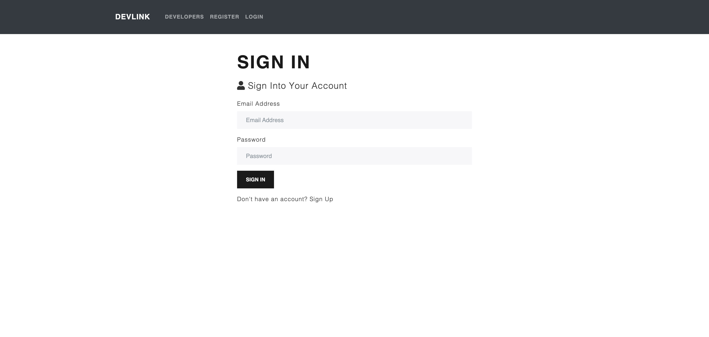

# DevLink
live at https://develop-link.herokuapp.com/

## What is DevLink?
Devlink is a platform designed for software developers to share job opportunities or collaborate with other developers.

## ScreenShots










## Prerequisites
- MongoDB
- Node
- NPM

## Installation
### Database
1. create database
2. setup database config in Devlink/config/default.json

### Backend
1. run 
```
npm install
npm start
```
### Frondend
1. modify Devlink/client/package.json
  - set "proxy": "https://localhost:8080"
2. run locally
```
cd client
npm install
npm start
```
